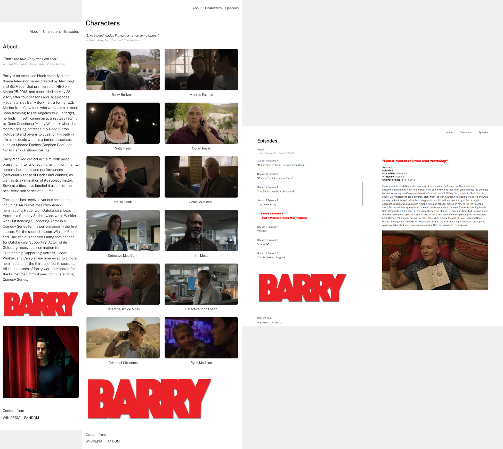

[View the Live Site!](https://elaborate-biscuit-0fa4e1.netlify.app/)

This project is a single-page application (SPA) built using React to provide an interactive and user-friendly experience for fans of the TV show Barry. The app is fully responsive, ensuring a smooth experience on mobile, tablet, and desktop devices.

- About/Home: General information about the show
- Characters: View the list of main characters with descriptions and additional details
- Episodes: Browse the list of episodes by season, including summaries and air dates

## Features

- Responsive Design: The website is fully responsive and adapts to different screen sizes, including mobile, tablet, and desktop views
- Single Page Application (SPA): The site utilizes React Router for seamless navigation without page reloads
- Hover Effects: Interactive hover effects for improved user experience
- Dynamic Content: Pages like "Characters" and "Episodes" dynamically display the data using React's useState and components

## Screenshots

Here are screenshots showcasing the website on various devices:

_from left to right: mobile, tablet, desktop_

## Used

- HTML/CSS/JavaScript
- ReactJS

## Acknowledgments

Sources for content and information:

- [Wikipedia - Barry (TV Series)](<https://en.wikipedia.org/wiki/Barry_(TV_series)>)
- [Barry Wiki](https://barry-hbo.fandom.com/wiki/Barry_Wiki)
